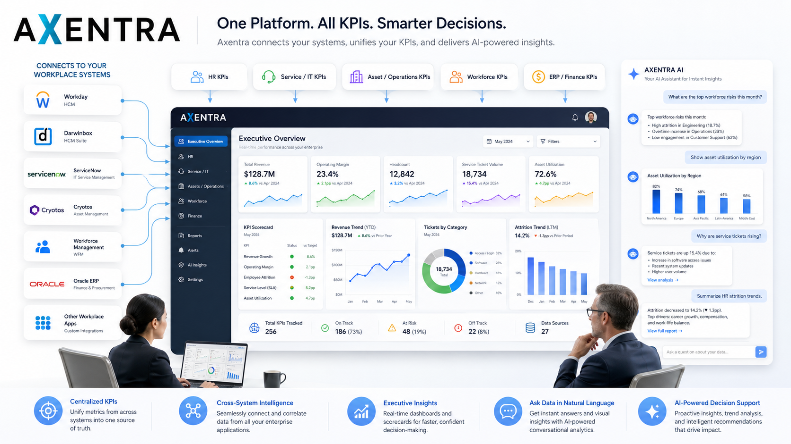

# Axentra Enterprise BI Architecture

## Agentic AI-Powered Centralized Business Intelligence Platform

This repository presents a sanitized enterprise architecture blueprint for **Axentra**, an Agentic AI-powered centralized business intelligence solution designed to connect with multiple workplace applications and convert fragmented operational data into executive-ready intelligence.

Axentra is positioned as a unified intelligence layer that can sit above enterprise systems such as HRMS, ITSM, ERP, asset management, workforce management, finance, procurement, and service operations platforms.

> **Important Notice**  
> This repository is shared only for portfolio, architecture demonstration, and technology leadership purposes. It does not include production source code, proprietary workflows, internal prompts, customer data, database schema, commercial algorithms, deployment secrets, or any confidential implementation details.

---

## 1. Executive Overview

Modern enterprises operate through several disconnected systems. Human resources may use one platform, IT service teams may use another, finance may depend on ERP, operations may use asset management tools, and workforce teams may maintain separate productivity systems.

Although each system contains valuable data, leadership teams often lack a centralized, trusted, and real-time view of business performance.

This creates common enterprise challenges:

- Fragmented reporting across business functions
- Delayed visibility into operational risks
- Heavy dependency on manual reporting
- Inconsistent KPI definitions
- Limited cross-functional intelligence
- Difficulty identifying patterns, anomalies, and performance gaps
- Lack of a single executive intelligence layer

Axentra is designed to solve this problem by acting as a centralized business intelligence and AI insight layer across enterprise applications.

---

## 2. Business Problem

Enterprises generate large volumes of operational data every day, but that data is usually spread across multiple platforms.

Examples include:

- Employee data in HRMS platforms
- Tickets and incidents in ITSM systems
- Asset records in asset management tools
- Financial transactions in ERP systems
- Productivity data in workforce management platforms
- Procurement and vendor data in finance systems
- Departmental metrics in internal trackers

Without a centralized intelligence layer, business leaders are forced to depend on static reports, manual spreadsheet consolidation, delayed updates, and fragmented dashboards.

This limits the organization’s ability to make fast, evidence-based decisions.

---

## 3. Solution Vision

Axentra is designed as a centralized intelligence platform that can connect to multiple enterprise systems, standardize business metrics, detect operational patterns, and provide AI-powered insights through dashboards, alerts, reports, and conversational business intelligence.

The platform vision includes:

- Unified business metrics
- Centralized executive dashboards
- Cross-application analytics
- Agentic AI-powered insight generation
- Natural language business querying
- Automated anomaly and trend detection
- Operational risk identification
- Executive-ready reporting
- Role-based access and governance
- Scalable enterprise integration model

---

## 4. High-Level Architecture



*Conceptual overview of the Axentra centralized business intelligence platform.*

```text
+-----------------------------------------------------------+
|                  Enterprise Applications                  |
|-----------------------------------------------------------|
| HRMS | ITSM | ERP | Asset Mgmt | Workforce | Finance | CRM |
+-----------------------------+-----------------------------+
                              |
                              v
+-----------------------------------------------------------+
|              Connector and Integration Layer              |
|-----------------------------------------------------------|
| API Connectors | Batch Imports | Webhooks | Secure Jobs    |
+-----------------------------+-----------------------------+
                              |
                              v
+-----------------------------------------------------------+
|                 Data Validation Layer                     |
|-----------------------------------------------------------|
| Schema Checks | Quality Rules | Missing Data | Duplicates   |
+-----------------------------+-----------------------------+
                              |
                              v
+-----------------------------------------------------------+
|                Data Normalization Layer                   |
|-----------------------------------------------------------|
| Mapping | Standardization | Entity Resolution | Enrichment |
+-----------------------------+-----------------------------+
                              |
                              v
+-----------------------------------------------------------+
|              Metrics Intelligence Engine                  |
|-----------------------------------------------------------|
| KPI Logic | Trends | Benchmarks | Variance | Thresholds    |
+-----------------------------+-----------------------------+
                              |
                              v
+-----------------------------------------------------------+
|                 Agentic AI Insight Layer                  |
|-----------------------------------------------------------|
| Reasoning | Summaries | Recommendations | Business Q&A    |
+-----------------------------+-----------------------------+
                              |
                              v
+-----------------------------------------------------------+
|              Dashboards, Alerts, and Reports              |
|-----------------------------------------------------------|
| CXO Dashboard | Department Views | Alerts | AI Assistant   |
+-----------------------------------------------------------+
```

---

## 5. Conceptual Platform Layers

### 5.1 Enterprise Source Systems

The source systems are the workplace applications that generate operational data.

Examples:

- HRMS platforms
- IT service management systems
- ERP platforms
- Asset management tools
- Workforce management systems
- Finance systems
- Procurement systems
- Internal business applications
- Department-level operational trackers

---

### 5.2 Connector and Integration Layer

This layer is responsible for securely connecting with different enterprise applications.

Possible integration patterns include:

- REST API integration
- Scheduled batch ingestion
- Secure file-based ingestion
- Webhook-based updates
- Database views
- Event-driven data pipelines

The goal of this layer is to bring fragmented data into a controlled and governed intelligence environment.

---

### 5.3 Data Validation Layer

Before data is used for metrics or AI insights, it must be validated.

Validation areas include:

- Required field checks
- Data type validation
- Duplicate detection
- Missing value detection
- Date consistency checks
- Referential integrity checks
- Source completeness checks
- Basic anomaly validation

This ensures that insights are not generated from unreliable or incomplete data.

---

### 5.4 Data Normalization Layer

Different systems often use different names, formats, and structures for similar business entities.

The normalization layer standardizes incoming data into common business definitions.

Examples:

- Department mapping
- Employee identifier mapping
- Cost center standardization
- Location normalization
- Status mapping
- Vendor name standardization
- Asset category alignment
- Ticket priority mapping

This layer helps create a trusted enterprise-wide data model without exposing the actual internal schema.

---

### 5.5 Metrics Intelligence Engine

The metrics intelligence engine transforms normalized data into meaningful business KPIs.

Example metric categories:

- Operational performance
- Workforce productivity
- Asset utilization
- Service performance
- Cost trends
- SLA compliance
- Risk indicators
- Department-level efficiency
- Process bottlenecks
- Exception trends

This layer converts raw enterprise data into measurable business intelligence.

---

### 5.6 Agentic AI Insight Layer

The Agentic AI layer provides intelligence beyond static dashboards.

Conceptual capabilities include:

- Natural language business queries
- Executive summaries
- Root-cause analysis assistance
- Trend explanations
- Risk alerts
- Recommended actions
- KPI commentary
- Cross-system correlation
- Automated insight narratives
- Context-aware decision support

Example user questions:

```text
Why did IT service resolution time increase this month?
Which department has the highest asset replacement risk?
Show workforce productivity trends for the last quarter.
Which operational metrics need leadership attention this week?
```

---

## 6. Core Capabilities

### 6.1 Unified Enterprise Metrics

Axentra is designed to bring business metrics from multiple applications into a single intelligence layer.

This helps leadership teams avoid conflicting reports and inconsistent KPI definitions.

---

### 6.2 Executive Dashboards

The platform can provide role-based dashboards for:

- CXO leadership
- Department heads
- Operations teams
- Finance teams
- HR teams
- IT teams
- Asset management teams
- Governance teams

Dashboards should focus on decision-making, not just data display.

---

### 6.3 AI-Powered Business Assistant

The AI assistant can help business users ask questions in natural language and receive context-aware insights.

Example:

```text
Question:
Why has asset allocation delay increased this month?

Possible AI Response:
Asset allocation delay increased due to a rise in pending approvals, delayed procurement updates, and higher request volume from two departments. The largest delay contributor appears to be approval aging beyond the standard threshold.
```

---

### 6.4 Automated Insight Generation

The platform can generate automated insights such as:

- Performance summaries
- Risk highlights
- KPI changes
- Month-over-month variance
- Department-level exceptions
- SLA breaches
- Cost spikes
- Operational bottlenecks

---

### 6.5 Anomaly and Trend Detection

The system can identify unusual patterns across enterprise metrics.

Examples:

- Sudden ticket volume increase
- Unusual asset movement
- Increased employee attrition trend
- Cost center spending spike
- SLA breach increase
- Workforce utilization drop
- Procurement cycle delay

---

### 6.6 Alerts and Notifications

The platform can support intelligent alerts based on business thresholds.

Examples:

- SLA breach risk
- High asset damage rate
- Unusual department spending
- Workforce productivity decline
- Service backlog increase
- Approval delay beyond threshold

---

### 6.7 Governance and Auditability

Enterprise intelligence platforms must be trustworthy.

Governance capabilities may include:

- Role-based access control
- Audit logs
- Data access tracking
- AI response traceability
- Metric definition ownership
- Approval workflows
- Data refresh monitoring
- Exception review process

---

## 7. Reference Data Flow

```text
Source System Data
        |
        v
Secure Ingestion
        |
        v
Data Validation
        |
        v
Data Normalization
        |
        v
Metric Computation
        |
        v
AI Insight Generation
        |
        v
Dashboard / Report / Alert / Assistant
        |
        v
Business Decision
```

---

## 8. Example Conceptual Data Model

This is only a simplified and sanitized sample. It does not represent the actual production database schema.

```json
{
  "sourceSystem": "HRMS",
  "businessFunction": "Human Resources",
  "department": "Operations",
  "metricName": "Employee Attrition Rate",
  "metricValue": 8.4,
  "metricUnit": "percentage",
  "period": "2026-04",
  "trend": "increasing",
  "riskLevel": "medium",
  "insight": "Attrition is higher than the previous quarter and requires leadership review."
}
```

Another example:

```json
{
  "sourceSystem": "Asset Management",
  "businessFunction": "IT Operations",
  "department": "Technology",
  "metricName": "Pending Asset Allocation Requests",
  "metricValue": 42,
  "metricUnit": "count",
  "period": "2026-04",
  "trend": "increasing",
  "riskLevel": "high",
  "insight": "Pending allocations have increased due to delayed approvals and limited available stock."
}
```

---

## 9. Example API Concepts

These are generic reference endpoints only. They do not represent actual production APIs.

```http
GET /api/v1/metrics/summary
GET /api/v1/metrics/trends
GET /api/v1/insights/anomalies
GET /api/v1/connectors/status
POST /api/v1/assistant/query
POST /api/v1/reports/generate
GET /api/v1/governance/audit-log
```

Example request:

```json
{
  "question": "Show top operational risks for this month",
  "businessFunction": "Operations",
  "timePeriod": "current_month"
}
```

Example response:

```json
{
  "summary": "Three operational risk areas require attention this month.",
  "risks": [
    {
      "area": "Asset Allocation",
      "riskLevel": "High",
      "reason": "Pending allocation requests increased compared to the previous month."
    },
    {
      "area": "Service Resolution",
      "riskLevel": "Medium",
      "reason": "Average resolution time exceeded the internal benchmark."
    },
    {
      "area": "Workforce Utilization",
      "riskLevel": "Medium",
      "reason": "Utilization variance increased across two departments."
    }
  ]
}
```

---

## 10. Agentic AI Design

The AI layer should not simply generate generic text. It should operate with business context, metric awareness, governance boundaries, and explainable reasoning.

### 10.1 AI Responsibilities

The AI layer may support:

- Understanding user intent
- Selecting relevant metrics
- Retrieving contextual data
- Comparing historical trends
- Explaining variance
- Summarizing risks
- Recommending next actions
- Generating executive narratives

---

### 10.2 AI Guardrails

The AI layer should follow enterprise guardrails such as:

- Do not expose unauthorized data
- Do not fabricate metrics
- Do not provide unsupported conclusions
- Show assumptions clearly
- Separate facts from recommendations
- Respect role-based access
- Maintain audit trail
- Escalate uncertain insights for human review

---

### 10.3 Human-in-the-Loop Review

For high-impact decisions, AI-generated insights should support human judgment rather than replace it.

Examples requiring review:

- Financial recommendations
- Workforce-related decisions
- Compliance-sensitive insights
- Vendor performance decisions
- Operational escalation decisions
- Policy-impacting recommendations

---

## 11. Security Model

A centralized business intelligence platform must be designed with strong security controls.

Recommended security principles:

- Role-based access control
- Least-privilege permissions
- Secure API authentication
- Encryption in transit
- Encryption at rest
- Environment-based configuration
- Secret management
- Audit logging
- Data masking where required
- Separation of production and non-production environments
- Secure integration with enterprise identity providers

---

## 12. Data Governance Model

Data governance is critical because different teams may define metrics differently.

Governance areas include:

- Metric ownership
- KPI definition approval
- Data refresh accountability
- Business glossary management
- Data lineage tracking
- Access control review
- Data quality monitoring
- Exception handling
- AI usage governance
- Report certification

---

## 13. Observability and Monitoring

A production-grade intelligence platform should be monitored across application, data, and AI layers.

Monitoring areas:

- API health
- Connector status
- Data ingestion success
- Data refresh latency
- Failed jobs
- Dashboard performance
- AI query volume
- AI response errors
- User access logs
- Cost and infrastructure usage
- Alert delivery success

---

## 14. Cloud and Deployment Considerations

A scalable deployment model may include:

- Containerized services
- API gateway or load balancer
- Managed relational database
- Object storage
- Background workers
- Scheduled jobs
- Queue-based processing
- Monitoring and logging
- Secret management
- CI/CD pipeline
- Environment separation

Deployment priorities:

- Reliability
- Security
- Scalability
- Cost control
- Operational visibility
- Disaster recovery readiness

---

## 15. Cost Optimization Principles

Enterprise AI and BI platforms should be built with cost governance from the beginning.

Cost optimization areas:

- Right-sized compute
- Scheduled workloads
- Efficient data refresh cycles
- Storage lifecycle policies
- Query optimization
- Container consolidation where practical
- Controlled AI usage
- Usage-based metering
- Monitoring cloud spend
- Removing unused resources

---

## 16. Example Executive Dashboard Areas

A leadership dashboard may include:

- Enterprise health score
- Department performance overview
- Operational risk summary
- SLA performance
- Workforce productivity
- Cost variance
- Asset utilization
- Ticket backlog
- Approval delays
- AI-generated executive summary
- Recommended action areas

---

## 17. Example Insight Categories

Axentra-style intelligence can generate insights across categories such as:

### Operational Insights

- Process delays
- Backlog growth
- SLA breaches
- Exception trends
- Workload imbalance

### Workforce Insights

- Utilization trends
- Productivity variance
- Attrition indicators
- Staffing gaps
- Department-level performance

### Asset Insights

- Allocation delays
- Stock aging
- Damage patterns
- Warranty exposure
- Replacement risk

### Financial Insights

- Spend variance
- Cost center anomalies
- Budget deviation
- Vendor cost trends
- Procurement cycle delays

### Service Insights

- Incident trends
- Resolution delays
- Request volume spikes
- Team-level SLA performance
- Recurring issue patterns

---

## 18. Enterprise Value Proposition

Axentra-style centralized intelligence can help organizations:

- Improve leadership visibility
- Reduce manual reporting effort
- Increase decision speed
- Identify risks earlier
- Improve operational accountability
- Standardize business metrics
- Enable AI-assisted decision support
- Connect fragmented enterprise applications
- Support governance-ready analytics
- Build a stronger data-driven culture

---

## 19. What This Repository Includes

This repository may include:

- High-level architecture concepts
- Sanitized diagrams
- Generic data flow examples
- Conceptual API examples
- AI governance principles
- Security considerations
- Observability guidelines
- Cost optimization principles
- Executive reporting concepts
- Portfolio-level documentation

---

## 20. What This Repository Does Not Include

This repository does not include:

- Production Axentra source code
- Proprietary product logic
- Real customer data
- Actual database schema
- Internal prompts
- Agent orchestration workflows
- Commercial algorithms
- API credentials
- Environment variables
- Infrastructure secrets
- Deployment scripts from production
- Private roadmap items
- Customer-specific configurations
- Confidential business rules

---

## 21. Suggested Repository Structure

```text
axentra-enterprise-bi-architecture/
│
├── README.md
├── docs/
│   ├── BUSINESS_PROBLEM.md
│   ├── SOLUTION_OVERVIEW.md
│   ├── HIGH_LEVEL_ARCHITECTURE.md
│   ├── AI_GOVERNANCE.md
│   ├── SECURITY_MODEL.md
│   ├── DATA_GOVERNANCE.md
│   ├── OBSERVABILITY_STRATEGY.md
│   └── CLOUD_COST_GOVERNANCE.md
│
├── diagrams/
│   ├── architecture-overview.png
│   ├── data-flow.png
│   └── agentic-ai-layer.png
│
├── samples/
│   ├── mock_metrics.json
│   ├── mock_connector_payload.json
│   └── sample_executive_insights.json
│
├── reference-api/
│   └── openapi-sanitized.yaml
│
├── adr/
│   ├── 001-platform-architecture.md
│   ├── 002-agentic-ai-layer.md
│   └── 003-data-security-model.md
│
└── NOTICE.md
```

---

## 22. Architecture Decision Records

Architecture Decision Records help demonstrate structured technology leadership.

Example ADR topics:

- Why a centralized intelligence layer is needed
- Why connectors should be separated from metric computation
- Why AI insights should be governed and auditable
- Why metric definitions require ownership
- Why production systems should separate ingestion, processing, and presentation layers
- Why AI-generated recommendations need human review for high-impact decisions

---

## 23. Leadership Perspective

This repository reflects a VP Technology / CTO-style approach to product architecture.

The focus is not only on building software, but on designing a scalable, secure, governed, and business-aligned enterprise platform.

Key leadership themes:

- Business problem clarity
- Architecture discipline
- AI governance
- Security-first thinking
- Enterprise integration maturity
- Cost-aware cloud design
- Product scalability
- Executive decision enablement

---

## 24. Future Conceptual Enhancements

Possible future platform capabilities may include:

- Predictive operational intelligence
- Department-level AI copilots
- Automated board-level reporting
- Cross-system root cause analysis
- Voice-based executive assistant
- Advanced anomaly detection
- Workflow recommendation engine
- Simulation and what-if analysis
- Enterprise benchmarking
- AI-powered governance review
- Integration marketplace

---

## 25. Disclaimer

This repository is a sanitized and non-production architecture reference.

It is intended to demonstrate enterprise architecture thinking, AI product strategy, and technology leadership. It should not be treated as a complete implementation, deployment guide, or commercial product source.

No confidential or proprietary production implementation details are included.

---

## 26. Ownership and Rights

Copyright © Leonard Simon. All rights reserved.

This repository is shared for portfolio and architectural demonstration purposes only.

No permission is granted to copy, modify, distribute, commercialize, or reuse the contents of this repository without written approval from the owner.
